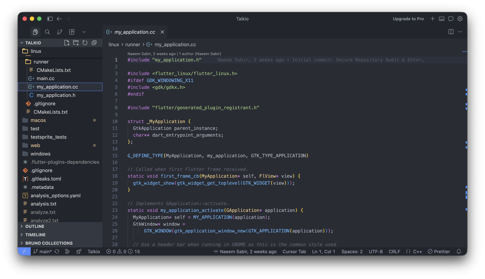

<div align="center">

# ✦ Naeem Sabir — Portfolio

### Full-Stack & AI Developer Portfolio Built with Next.js, GSAP & Framer Motion

[](https://nextjs.org/)
[](https://react.dev/)
[](https://www.typescriptlang.org/)
[](https://tailwindcss.com/)
[](https://gsap.com/)
[](https://www.framer.com/motion/)

<br/>

**A production-grade, animated developer portfolio** featuring a 300-frame hero scroll sequence, interactive canvas playgrounds, glassmorphism UI, and live project showcases — all crafted with pixel-perfect attention to detail.

<br/>

[📁 Projects](#-projects-showcase) &nbsp;·&nbsp; [⚡ Features](#-features) &nbsp;·&nbsp; [🛠 Tech Stack](#-tech-stack) &nbsp;·&nbsp; [🚀 Getting Started](#-getting-started)

<br/>



</div>

---

## 📋 Table of Contents

- [Overview](#-overview)
- [Features](#-features)
- [Projects Showcase](#-projects-showcase)
- [Tech Stack](#-tech-stack)
- [Architecture](#-architecture)
- [Getting Started](#-getting-started)
- [Project Structure](#-project-structure)
- [Performance](#-performance)
- [Design System](#-design-system)
- [About the Developer](#-about-the-developer)

---

## 🌟 Overview

This portfolio is more than a static page — it's an **interactive experience** engineered to showcase full-stack and AI development skills through the very medium it's built with. Every section is intentional:

- **The hero** proves advanced animation engineering (300 canvas frames, GSAP scroll orchestration)
- **The playground** proves creative coding ability (physics systems, particle engines)
- **The work** proves real-world impact (6 shipped products across e-commerce, AI SaaS, and mobile)
- **The stack** proves technical breadth (Flutter → React → Python → AI pipelines)

> *"I believe that the best software is not just functional, but deeply intuitive and beautifully crafted."* — Naeem Sabir

---

## ⚡ Features

### 🎬 Hero Scroll Sequence
- **300-frame canvas animation** rendered at device pixel ratio for crisp display on retina screens
- GSAP `ScrollTrigger` drives frame playback — scroll = cinema
- 3D perspective transforms: text pushes forward in Z-space as you scroll
- Dashboard mockup scales from `0.3 → 1.0` with spring easing at 60–90% scroll progress
- Navigation fades out seamlessly during the cinematic sequence

### 🎨 Interactive Canvas Playgrounds
Three fully custom canvas-based demos built from scratch:

| Demo | Description |
|------|-------------|
| **Gravity Garden** | Click anywhere to plant branching particle trees with animated leaves |
| **Particle Painter** | Mouse-driven particle emission — velocity maps to color (green → gold) |
| **Magnetic Typography** | Letters spring toward your cursor within a configurable influence radius |

### 📐 Glassmorphism Design System
- `backdrop-filter: blur()` glass cards throughout
- Layered shadows (inner glow + outer depth) for premium 3D feel
- Apple-inspired color language: `#2d6a4f` moss green accent, `#1d1d1f` deep black
- Fluid responsive typography using CSS `clamp()` — scales from mobile to 4K

### 🏗 Bento Grid Layout
- Asymmetric responsive grid for tech stack showcase
- First and last cards span full width for visual rhythm
- 3D tilt effect on hover — mouse position mapped to `rotateX` and `rotateY`

### 📱 App & Website Project Cards
- **App cards:** Phone frame mockups with mouse-tracking 3D rotation
- **Website cards:** Live `<iframe>` embeds with browser chrome UI
- **Glass modal:** Full case study, tech stack pills, live + GitHub links

### 🌊 Smooth Scrolling Architecture
- **Lenis** physics-based smooth scroll (zero-lag smoothing)
- GSAP ScrollTrigger synced with Lenis `raf` loop
- 120fps butter-smooth scroll even with heavy canvas rendering

### 📊 Animated Metrics Counter
- 30+ Projects · 6+ Years · 100% Client Satisfaction
- Numbers animate up when scrolled into view using Framer Motion `useMotionValue`

---

## 💼 Projects Showcase

### Mobile Applications

| Project | Type | Stack | Status |
|---------|------|-------|--------|
| **Talkio** | AI Voice App | Flutter, Dart, OpenAI API | Shipped |

### Web Applications

| Project | Type | Stack |
|---------|------|-------|
| **Sands Collections** | E-Commerce | Next.js, TypeScript, Stripe |
| **SopWriter** | AI SaaS | Next.js, OpenAI, Supabase |
| **MoussenMelts** | Bakery Website | Next.js, Tailwind CSS |
| **MM Vapers** | Storefront | Next.js, TypeScript |
| **CreatubeAI** | Video Gen SaaS | Next.js, AI Pipeline |

---

## 🛠 Tech Stack

### Frontend
```
Next.js 16.1.6     →  App Router, Server Components, Image Optimization
React 19.2.3       →  Latest concurrent features
TypeScript 5       →  Full type safety across components and data
Tailwind CSS 4     →  Utility-first styling with custom design tokens
```

### Animation & Motion
```
GSAP 3.14.2        →  ScrollTrigger, timeline orchestration, 300-frame canvas
Framer Motion 12   →  Component animations, useScroll, useTransform, spring physics
Lenis 1.3.18       →  Smooth scroll with GSAP RAF synchronization
```

### Utilities
```
clsx 2.1.1         →  Conditional className utility
tailwind-merge     →  Merge conflicting Tailwind classes safely
```

### Tooling
```
ESLint 9           →  Next.js-specific linting rules
PostCSS            →  Tailwind CSS processing pipeline
```

---

## 🏛 Architecture

```
Naeem Portfolio/
├── app/
│   ├── layout.tsx              # Root layout: fonts, LenisProvider, metadata
│   ├── page.tsx                # Home page — section composition
│   └── globals.css             # Design system, custom animations, CSS vars
│
├── components/
│   ├── HeroScrollSequence.tsx  # 300-frame canvas hero with GSAP ScrollTrigger
│   ├── Navbar.tsx              # Scroll-aware glassmorphic navigation
│   ├── Footer.tsx              # Site footer
│   ├── ProjectCard.tsx         # Reusable project card component
│   ├── CanvasScroll.tsx        # Generic canvas frame-sequence renderer
│   │
│   ├── sections/               # Full-page sections (composition layer)
│   │   ├── HeroDivider.tsx     # SVG wave transition hero → about
│   │   ├── AboutSection.tsx    # Bio, metrics counter, profile
│   │   ├── StackSection.tsx    # Bento grid tech stack showcase
│   │   ├── WorkSection.tsx     # Apps + websites portfolio grid
│   │   ├── PlaygroundSection.tsx # Three interactive canvas demos
│   │   └── ContactSection.tsx  # CTA, services, contact links
│   │
│   ├── ui/                     # Reusable primitives
│   │   ├── BentoGrid.tsx       # Asymmetric bento grid with tilt
│   │   ├── GlassModal.tsx      # Full case study modal
│   │   ├── HorizontalScroll.tsx # Scroll-driven horizontal carousel
│   │   └── TextReveal.tsx      # Word-by-word scroll reveal
│   │
│   └── providers/
│       └── LenisProvider.tsx   # Smooth scroll context + GSAP sync
│
├── data/
│   └── content.ts              # All project data, about info, tech stack
│
├── lib/
│   └── utils.ts                # cn() utility (clsx + tailwind-merge)
│
└── public/
    ├── Dashboard.png           # Hero mockup image
    ├── Frames/                 # 300 JPEG frames for hero animation
    ├── my-image.png            # Developer profile photo
    └── [project screenshots]   # Portfolio project preview images
```

### Animation Architecture
```
Lenis (smooth scroll)
     ↓ RAF sync
GSAP ScrollTrigger ←→ HeroScrollSequence (canvas frames)
     +
Framer Motion (component-level: useScroll, whileInView, spring)
```

---

## 🚀 Getting Started

### Prerequisites
- **Node.js** 18.17+ or 20+
- **npm** 9+ (or pnpm / yarn)

### Installation

```bash
# 1. Clone the repository
git clone https://github.com/naeemsabir1/naeem-portfolio.git
cd naeem-portfolio

# 2. Install dependencies
npm install

# 3. Start the development server
npm run dev
```

Open [http://localhost:3000](http://localhost:3000) in your browser.

### Available Scripts

```bash
npm run dev      # Start development server (http://localhost:3000)
npm run build    # Production build with optimization
npm run start    # Start production server
npm run lint     # Run ESLint for code quality
```

> No environment variables required. The project is fully driven by `data/content.ts`.

---

## ⚡ Performance

- **Canvas rendering** uses `devicePixelRatio` scaling for crisp display on all screens
- **GPU acceleration** applied to animated elements via `will-change` and `backface-visibility`
- **Lenis smooth scroll** eliminates jank with physics-based easing
- **Next.js Image** optimization for all static assets
- **Code splitting** — each section is a separate component, loaded efficiently
- **`"use client"` directives** only where necessary to preserve SSR benefits

---

## 🎨 Design System

### Color Palette
| Token | Hex | Usage |
|-------|-----|-------|
| Accent | `#2d6a4f` | CTA buttons, highlights, borders |
| Apple Blue | `#0071e3` | Links, interactive states |
| Surface Light | `#F8F9FA` | Section backgrounds |
| Glass BG | `rgba(255,255,255,0.6)` | Cards, modals |
| Text Primary | `#1d1d1f` | Headlines, body |
| Text Secondary | `#6e6e73` | Subtitles, captions |

### Typography
- **Display** — `Outfit` (Google Fonts) for hero headings
- **Body** — `Inter` (Google Fonts) for readable body copy
- **Scale** — Fluid responsive sizing with `clamp()`: `clamp(36px, 6vw, 76px)` for heroes

### Animation Principles
- **Easing** — `power2.out` for entrances, `power2.inOut` for transitions
- **Duration** — 0.3s for micro-interactions, 0.6s for section transitions
- **Stagger** — 0.1s delay between list items for cascade feel
- **Spring** — Framer Motion physics for all hover and interactive states

---

## 👨‍💻 About the Developer

**Naeem Sabir** is a Full-Stack & AI Developer based in **Lahore, Pakistan**, studying Computer Science at the **University of Management & Technology (UMT)**.

Specializations:
- **Mobile Development** — Flutter & Dart apps with polished UX
- **Web Development** — React, Next.js, TypeScript full-stack applications
- **AI Integration** — OpenAI APIs, agentic models, AI-powered SaaS products
- **High-Performance UI** — Advanced animations, canvas rendering, 3D transforms

**Connect:**

[](https://github.com/naeemsabir1)

---

## 📄 License

This project is open source and available under the [MIT License](LICENSE).

Feel free to use this as **inspiration** for your own portfolio. If you clone or fork it, a ⭐ star and credit are greatly appreciated!

---

<div align="center">

**If this project inspired you or taught you something new — drop a ⭐ star, it means the world!**

Built with ❤️ and obsessive attention to detail by [Naeem Sabir](https://github.com/naeemsabir1)

*Next.js · React 19 · TypeScript · GSAP · Framer Motion · Tailwind CSS · Lenis*

</div>
